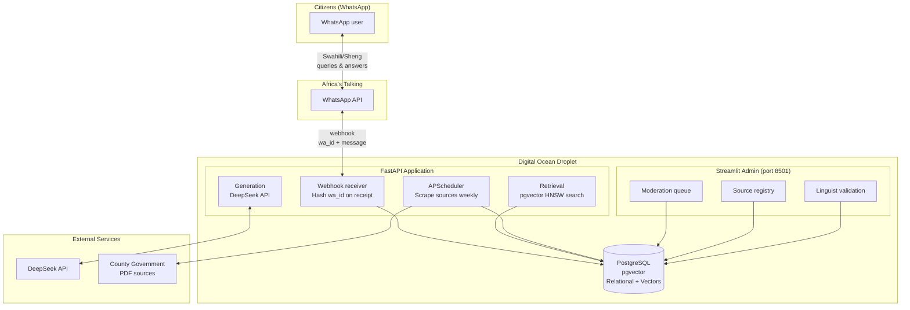

# Wazi — Strategic Plan for 5-Week MVP Build

> Prepared: 2026-07-16
> Team: Chris Waweru Gichohi & Joyline Njeri Wanjiru (WAZIRI)
> Context: Democracy & AI Hackathon → MVP development sprint

---

## Table of Contents

1. [Current Architecture Analysis](#1-current-architecture-analysis)
2. [Resource Allocation](#2-resource-allocation)
3. [5-Week Parallel Workflow](#3-5-week-parallel-workflow)
4. [Feature Prioritization](#4-feature-prioritization)
5. [Compromises Worth Making](#5-compromises-worth-making)
6. [Features Potentially Overlooked](#6-features-potentially-overlooked)
7. [Research Required](#7-research-required)
8. [Responsible Computing Integration](#8-responsible-computing-integration)
9. [Target Architecture](#9-target-architecture)
10. [Immediate Next Actions](#10-immediate-next-actions)

---

## 1. Current Architecture Analysis

### 1.1 How the Project Currently Works

#### Build-Time Pipeline (Ingestion)

```
PDF files (hardcoded list)
    ↓  extract.py: PyMuPDF (fitz) opens each PDF, checks for extractable text layer,
    |              extracts per-page text, skips blank/cover pages
    ↓  chunk.py:  word-based sliding-window chunking (500 words, 50 overlap),
    |             chunks never cross page boundaries → every chunk is traceable
    ↓  chunks.json:  written to data/chunks.json
    ↓  embed.py:  fastembed loads paraphrase-multilingual-MiniLM-L12-v2 (ONNX),
    |             embeds every chunk, L2-normalizes, builds FAISS IndexFlatIP
    ↓  In-memory FAISS index:  lazy-loaded once, cached in module globals
```

#### Runtime Query Pipeline

```
Citizen types query (Swahili/Sheng/English)
    ↓  streamlit_app.py: ask(query) → calls pipeline.get_response(query)
    ↓  pipeline.py: check_value_for_money() — regex-based trigger detection
    |  [if VFM trigger word found → hardcoded regex extraction + benchmark comparison]
    ↓  embed.py: retrieve(query, k=4) — embed query → FAISS inner-product search → top-4 chunks
    ↓  pipeline.py: format chunks as numbered CONTEXT, compose SYSTEM_PROMPT + user_content
    ↓  DeepSeek API — generate grounded answer
    ↓  Parse USED_CHUNK marker, strip citation line, derive source citation
    ↓  Return {"text": ..., "citation": ..., "last_updated": ...}
    ↓  streamlit_app.py: render assistant bubble with text + citation + dispute button
```

#### The Two AI Touchpoints

1. **Retrieval (semantic search):** The multilingual MiniLM embedding model maps both the English corpus and Swahili/Sheng queries into a shared vector space for cross-lingual retrieval without translation middleware.

2. **Grounded generation + register translation:** DeepSeek receives retrieved chunks as its sole knowledge source. The system prompt enforces: answer only from context, detect the user's language register, reply in the same register, cite the source, and emit a machine-readable `USED_CHUNK` marker.

> **Note:** The "comparative reasoning" (value-for-money check) is currently not AI-driven — it's a regex-based scripted rule with hardcoded project markers and benchmarks. This is a hackathon shortcut that needs to be replaced with LLM-driven comparative reasoning.

### 1.2 Module Coupling Assessment

#### Well-Decoupled

| Boundary | Mechanism | Quality |
|----------|-----------|---------|
| **UI ↔ Pipeline** | `pipeline_interface.py` defines `PipelineResponse` (TypedDict) and `Pipeline` (Protocol) | Good contract, but UI imports concrete function directly — Protocol is unused |
| **Extraction ↔ Chunking** | `extract_pages()` returns `list[dict]`, `chunk_pages()` consumes `list[dict]` | Clean data-only coupling |
| **Chunking ↔ Embedding** | `chunks.json` as intermediate file artifact | File-based decoupling |
| **Embedding ↔ Retrieval** | Module globals with lazy init | Singleton pattern; retrieval never knows about build step |
| **LLM Provider Selection** | `config.PROVIDER` flag + separate generation functions | Clean strategy-like dispatch |

#### Tightly Coupled (Needs Refactoring)

| Issue | Location | Risk |
|-------|----------|------|
| **Pipeline does too much** | `pipeline.py` contains corpus building, VFM logic, generation dispatch, response parsing, and CLI demo code | Hard to test individually |
| **Hardcoded PDF list** | `pipeline.py` `PDF_FILES = [...]` | Adding a source requires code change |
| **Hardcoded VFM triggers + benchmarks** | `pipeline.py` | "Comparative reasoning" is actually scripted |
| **UI directly imports pipeline** | `streamlit_app.py` imports concrete `get_response` | Cannot swap to mock without changing imports |
| **Dispute state in Streamlit session_state** | `streamlit_app.py` | Ephemeral — lost on restart, no real moderation workflow |
| **No abstraction between retrieval and generation** | `pipeline.py` `get_response()` | Retriever and generator glued together |

### 1.3 Current Strengths

- Clean ingestion pipeline with clear separation between stages
- Defensive error handling with fallback to Swahili "I don't have enough information"
- Cross-lingual retrieval via multilingual embedding model
- Strict grounding in the system prompt with machine-readable chunk markers
- Lazy model loading via `@st.cache_resource` and module-level singletons
- Provider abstraction (Anthropic/DeepSeek) with graceful degradation
- WhatsApp-inspired UI with proper bubble styling and dark mode

### 1.4 Current Weaknesses & Risks

- **No persistence layer** — FAISS index, disputes, chat history all in memory
- **Hardcoded corpus** — two PDFs, no ingestion scheduler, no source registry
- **Brute-force FAISS** — `IndexFlatIP` doesn't scale beyond ~100 chunks
- **Pipeline protocol unused** — `mock_pipeline.py` is empty, no UI/backend swap possible
- **`pipeline.py` is a god module** — mixes orchestration, business logic, and I/O
- **VFM "AI" is fake** — regex-based with hardcoded benchmarks
- **No WhatsApp integration** — Streamlit is a stand-in, not a bridge
- **No dispute/moderation workflow** — in-memory counter only
- **No authentication, no session management**
- **Zero tests**
- **Single county** (Nakuru only)

---

## 2. Resource Allocation

### 2.1 DeepSeek API

| Use | Details |
|-----|---------|
| **RAG generation (Swahili/Sheng)** | Primary LLM for answer generation. Simplify to single provider. |
| **PDF parsing & document structuring** | Use large context window to restructure extracted text — e.g., "Extract all budget line items with amounts into JSON" |
| **Coding assistance** | Code review before PRs, schema design, query writing, debugging |

### 2.2 Africa's Talking WhatsApp API

**This is the primary user interface.** Key architectural implications:

- **Streamlit is demoted** from citizen-facing UI to admin/moderation dashboard (authenticated)
- **The citizen UI is now WhatsApp.** All design decisions flow from this: response length limits, formatting constraints, session management
- **Research immediately:** webhook format, rate limits, sandbox/testing mode
- **The `wa_id` they provide becomes the hashed user identifier**

### 2.3 Digital Ocean Droplets

| Droplet | Purpose | Spec |
|---------|---------|------|
| **App server** | FastAPI (WhatsApp webhook + pipeline API) | 2 vCPU, 4 GB RAM |
| **Database** | PostgreSQL (DO managed Postgres recommended) | 2 vCPU, 4 GB RAM |
| **(Optional) Worker** | Background jobs (PDF scraping, index rebuilds) | 1 vCPU, 2 GB RAM |

Use Docker Compose for local dev parity. Deploy via `docker-compose.yml` on droplet.

### 2.4 PostgreSQL + pgvector (Not Pinecone)

**Recommendation: Use PostgreSQL with pgvector, not Pinecone.**

| Factor | PostgreSQL + pgvector | Pinecone |
|--------|----------------------|----------|
| **Cost** | Free (runs on your droplet) | Paid managed service |
| **Ops burden** | You manage it | Managed for you |
| **Relational + vector in one** | Yes — users, sessions, disputes, sources, AND embeddings in one DB | No — need separate relational DB |
| **Why it wins** | One database, one backup, one connection string. For a 2-person team in 5 weeks, reducing infrastructure surface area is critical. | Only if outgrowing pgvector |

**Migration path:** Replace FAISS `IndexFlatIP` with pgvector's `hnsw` index. Same embedding model (fastembed), vectors stored and queried via PostgreSQL. This gives persistence, incremental updates, and one less moving part.

### 2.5 Text-to-Speech & Translation/Localization APIs

**Recommendation: Defer TTS to post-MVP.** Voice adds latency, cost, and storage complexity. Text-first is the right MVP scope.

**Translation APIs:** The current system handles translation implicitly via the multilingual embedding model + LLM's native multilingual capability. No separate translation middleware needed — it would add latency without improving quality.

---

## 3. 5-Week Parallel Workflow

### 3.1 Task Split

| Week | Joyline (Backend/AI) | Chris (Frontend/Architecture) | Shared |
|------|---------------------|-------------------------------|--------|
| **1** | PostgreSQL schema (users, sessions, disputes, sources, chunks); FastAPI webhook endpoint for Africa's Talking; hash wa_id on receipt | Streamlit admin dashboard with authentication; deploy scaffold on DO droplet; set up CI/CD (GitHub Actions → DO) | Agree on API contract between FastAPI and admin dashboard; set up Docker Compose |
| **2** | Migrate FAISS → pgvector; refactor `pipeline.py` into separate modules (`retrieve.py`, `generate.py`, `orchestrate.py`); wire WhatsApp → pipeline | Moderation queue UI (list disputes, filter by status, review panel); dispute state machine UI | Test end-to-end: WhatsApp message → answer → dispute → moderation |
| **3** | Scheduled ingestion: APScheduler cron job that scrapes source URLs, runs extract→chunk→embed, updates pgvector; source registry API | Source registry admin UI (add/edit/remove sources, trigger manual re-ingestion); corpus health dashboard | Integration test: add source → scrape → query → verify answer cites new source |
| **4** | Anti-bot dispute logic: time-window analysis, hashed-wa_id diversity check, velocity thresholds; API rate limiting | Prompt engineering with linguist feedback; design validation workflow for native speakers to rate answer quality | Joint prompt tuning session; document system prompt iteration history |
| **5** | Test suite (pytest); API documentation; environment hardening | Security audit; responsible computing checklist compliance; pitch deck and demo preparation | Threat model session; deploy to production DO droplet; record demo video |

### 3.2 GitHub Workflow

- **Branch strategy:** `main` (protected, deployable), `dev` (integration), feature branches (`joyline/whatsapp-webhook`, `chris/admin-dashboard`)
- **No direct commits to `main`.** All work via PRs with the other person as reviewer.
- **Daily sync:** 15-minute standup. What did you finish? What are you doing today? What's blocking you?
- **API contract first:** Before either person starts coding a cross-boundary feature, write the API spec together (OpenAPI YAML or markdown table).
- **Use DeepSeek for code review:** Before opening a PR, paste the diff into DeepSeek and ask "Review this for bugs, security issues, and adherence to the API contract."

---

## 4. Feature Prioritization

### Tier 1 — Must Ship (Weeks 1-4)

| Feature | Rationale |
|---------|-----------|
| **WhatsApp webhook receiver** | The product is WhatsApp. Without this, there is no product. |
| **Hashed wa_id identity** | Required by responsible computing principles. Built into webhook from day one. |
| **RAG pipeline with pgvector** | Core value proposition. FAISS → pgvector migration is prerequisite for persistence. |
| **Admin dashboard (authenticated)** | Moderators need a place to review disputes. Streamlit with password protection sufficient for MVP. |
| **Dispute database + moderation queue** | Core differentiator — the "community verification signal" from the problem statement. |
| **Source registry + scheduled ingestion** | Moves from hardcoded PDFs to a living system. |

### Tier 2 — Ship if Time Allows (Week 5)

| Feature | Rationale |
|---------|-----------|
| **Anti-bot dispute thresholds** | Important for integrity. Simple time-window + unique-wa_id check sufficient for MVP. |
| **Cross-source triangulation** | Flag when two official sources disagree on the same figure. |
| **EACC escalation pathway** | Templated email with anonymized report — high impact, low implementation cost. |
| **Multi-turn conversations** | Allow follow-up questions with conversation context. |

### Tier 3 — Post-MVP

| Feature | Rationale |
|---------|-----------|
| **Text-to-speech / voice notes** | Adds significant complexity; text loop must work first. |
| **Multi-county support** | Nakuru-only is fine for MVP. Design Source model with `county` field now. |
| **Public transparency dashboard** | Show anonymized aggregate stats — builds trust with civil society. |

---

## 5. Compromises Worth Making

| Compromise | Why It's Acceptable |
|------------|-------------------|
| **Single county (Nakuru)** | Proves the model. Multi-county is a configuration change if you design the Source model with a `county` field now. |
| **No TTS/voice** | Voice adds latency, cost, storage. WhatsApp supports voice notes natively — users can send voice queries; you just don't transcribe or respond in voice yet. |
| **Streamlit for admin, not custom React** | For an internal admin tool used by 2-3 moderators, Streamlit is sufficient. Custom React admin can come later. |
| **PostgreSQL + pgvector (not Pinecone)** | One database to manage, back up, and secure. One less service to pay for and integrate. |
| **Simple scheduler (APScheduler), not Celery + Redis** | For scraping a handful of government PDFs weekly, a single-process scheduler in FastAPI is fine. |
| **No real-time dispute notifications** | Moderators check the queue manually. Push notifications can be added later. |
| **Single LLM provider (DeepSeek)** | You have the API key. Simplify config, remove Anthropic/DeepSeek branching, focus prompt engineering on one model. |

---

## 6. Features Potentially Overlooked

### 6.1 Answer Feedback Loop for Linguist Validation

- Every generated answer gets a unique `answer_id`
- A separate authenticated endpoint shows random answers with original query, retrieved chunks, and generated response
- Linguist rates: tone appropriate (1-5), factually grounded (yes/no), register correct (formal Swahili / Sheng / English / mixed)
- This data feeds into prompt improvement

### 6.2 "I Don't Understand" — Graceful Failure

When the LLM returns "sina taarifa za kutosha":
- Suggest related questions the user could ask (based on what the corpus *does* contain)
- Offer to escalate to a human researcher
- Log unknown queries for corpus gap analysis — these become the priority list for adding new sources

### 6.3 Public Transparency Dashboard

A simple public-facing page showing:
- Number of questions answered this month
- Most-asked-about projects
- Most-disputed claims (anonymized)
- Sources in the corpus

Builds trust with civil society and demonstrates impact to funders.

### 6.4 Conversation History for the Citizen

Store conversation history linked to hashed wa_id so citizens can have multi-turn conversations with context.

### 6.5 Offline/Async Responses

Acknowledge receipt immediately ("Natafuta jibu..."), process asynchronously, send answer when ready. Africa's Talking supports sending messages outside of webhook response.

---

## 7. Research Required

| Research Area | Why | Action |
|---------------|-----|--------|
| **Africa's Talking WhatsApp API docs** | Understand webhook format, rate limits, sandbox, message templates before writing code | Joyline: Day 1 task |
| **Kenya Data Protection Act 2019 registration** | May need to register as data controller/processor | Chris: Research ODPC registration process |
| **IBP Kenya / Controller of Budget data formats** | If machine-readable data is available, what format? CSV? JSON? API? | Both: Schedule introductory meeting |
| **Sheng language register nuances** | Sheng is fluid and context-dependent. System prompt needs register detection guide. | Chris: Work with peer linguists |
| **pgvector HNSW index parameters** | Tune `m` and `ef_construction` for 384-dim MiniLM embeddings | Joyline: Benchmark with corpus size |
| **Government PDF publication schedules** | Align ingestion scheduler with county publication cadence | Chris: Research Nakuru county calendar |

---

## 8. Responsible Computing Integration

### 8.1 Architecture-Level Privacy

```
Citizen (WhatsApp)
    │
    ▼
[Africa's Talking] ─── wa_id ──→ [SHA-256(wa_id + SALT)] → Stored as user_id
    │                              Raw wa_id: never logged, never stored
    │
    ▼
[FastAPI webhook] ─── HTTPS (Let's Encrypt)
    │
    ├── Query ──→ [Pipeline] ──→ Answer ──→ WhatsApp
    │
    ├── Dispute ──→ [Disputes table]
    │               user_id (hashed), message_id, reason, timestamp
    │               ⚠ NO link to query content in same table
    │
    └── Chat history ──→ [Messages table]
                         user_id (hashed), query, answer, citation, timestamp
                         ⚠ Separate from disputes — cannot query "who reported what"
```

### 8.2 Security Principles → Implementation

| Principle | Implementation |
|-----------|---------------|
| **Data minimisation** | Store only `hashed_wa_id`, `timestamp`, `query_text`, `answer_text`, `citation`. Never store phone number, name, location, or profile data. |
| **Encrypt in transit and at rest** | HTTPS via Let's Encrypt. PostgreSQL encryption at rest (DO managed Postgres or LUKS on droplet). |
| **Never store identifiers in the clear** | `SHA-256(wa_id + os.getenv("ID_SALT"))` on receipt. Salt is 32 random bytes in env var, never committed. |
| **Separate identity from content** | Disputes table stores `(hashed_user_id, message_id, reason, timestamp)`. Messages table stores `(hashed_user_id, query, answer, timestamp)`. No join links a user to their disputed content — the dispute is a signal on the *answer*, not a dossier on the *user*. |
| **Keep secrets out of repository** | `.env` in `.gitignore`. `.env.example` with placeholder values. GitHub secret scanning enabled. Rotate keys if any were ever committed. |
| **Lock down accounts** | 2FA on GitHub and DO. Separate DO accounts with least-privilege IAM. Use SSH keys, not passwords. |
| **Set a retention period** | Write `DATA_RETENTION.md` policy. Chat logs auto-delete after 90 days. Dispute records after 1 year. Backups retained 30 days. Implement as cron job. |
| **Threat-model before launch** | 2-hour session. Questions: Who wants this data? (Corrupt officials, county governments, cybercriminals.) What can they do with it? What happens if server is seized? Design mitigations for each threat. |
| **Know the legal landscape** | Research ODPC registration. Kenya Data Protection Act 2019 applies. Document lawful basis for processing (legitimate interest — civic accountability). |
| **Secure team communication** | Use Signal for sensitive discussions. Don't discuss security incidents in WhatsApp or email. |

### 8.3 Additional Responsible Computing Metrics
4. **Coverage gaps disclosure.** Publish exactly which of the 10 CBTS-defined budget
   documents are in the corpus for each county, e.g.: "Wazi currently covers Nakuru's
   Q1 Budget Implementation Report and Auditor-General's Report. We do not yet cover
   the Annual Development Plan, County Fiscal Strategy Paper, Approved Programme-Based
   Budget, Citizens Budget, Finance Act, Q2/Q3/Q4 Implementation Reports, or the County
   Budget Review and Outlook Paper." This should be a generated statement, not a
   hand-written one — see Source model note below.
   (Corrected 2026-07-28: the corpus BIRR was verified against its cover page —
   it is the Q1 FY2024/25 edition, previously mislabeled as Q2.)
---

## 9. Target Architecture



### Proposed Project Structure (Target)

```
.
├── src/
│   ├── api/                        ← FastAPI application (NEW)
│   │   ├── __init__.py
│   │   ├── main.py                 ← FastAPI app entry point
│   │   ├── webhooks.py             ← Africa's Talking webhook receiver
│   │   ├── routes/                 ← API routes for admin dashboard
│   │   │   ├── disputes.py
│   │   │   ├── sources.py
│   │   │   └── validation.py
│   │   └── middleware/
│   │       └── identity.py         ← wa_id hashing middleware
│   ├── admin/                      ← Streamlit admin dashboard (REFACTORED)
│   │   ├── __init__.py
│   │   └── dashboard.py
│   ├── ingestion/                  ← Refactored pipeline
│   │   ├── __init__.py
│   │   ├── extract.py              ← Unchanged
│   │   ├── chunk.py                ← Unchanged
│   │   ├── embed.py                ← Migrated to pgvector
│   │   ├── retrieve.py             ← NEW: pgvector retrieval
│   │   ├── generate.py             ← NEW: LLM generation (DeepSeek only)
│   │   ├── orchestrate.py          ← NEW: pipeline orchestration
│   │   ├── scheduler.py            ← NEW: APScheduler for source scraping
│   │   └── vfm.py                  ← NEW: LLM-driven value-for-money
│   ├── shared/
│   │   ├── __init__.py
│   │   ├── config.py               ← Simplified (DeepSeek only)
│   │   ├── database.py             ← NEW: PostgreSQL connection + session
│   │   ├── models.py               ← NEW: SQLAlchemy models
│   │   └── pipeline_interface.py   ← Unchanged
│   └── main.py
├── tests/                          ← NEW
│   ├── test_extract.py
│   ├── test_chunk.py
│   ├── test_retrieve.py
│   └── test_webhook.py
├── docker-compose.yml              ← NEW
├── Dockerfile                      ← NEW
├── DATA_RETENTION.md               ← NEW
├── docs/
│   ├── problem-statement.md
│   ├── strategic-plan.md           ← This file
│   └── api-contract.md             ← NEW: API specification
└── ...
```

---

## 10. Immediate Next Actions (Day 1-2)

1. **Both:** Read Africa's Talking WhatsApp API documentation. This is the critical path.
2. **Joyline:** Scaffold the new project structure and PostgreSQL schema (`src/shared/models.py`, `src/shared/database.py`).
3. **Chris:** Set up the Digital Ocean droplet with Docker Compose and deploy the current Streamlit app as a placeholder.
4. **Both:** Write the API contract (`docs/api-contract.md`) — FastAPI endpoints the admin dashboard will consume.
5. **Both:** Schedule the threat-modeling session.
6. **Both:** Schedule the IBP Kenya introductory meeting.
7. **Both:** Contact peer linguists in the cohort for validation collaboration.


### 1.5 Corpus Coverage Gap (confirmed via CBTS research, 2026-07-23)

Kenya's County Budget Transparency Survey (Bajeti Hub, formerly IBP Kenya) evaluates
counties against 10 legally mandated documents across the budget cycle. Current Wazi
corpus coverage against this framework:

| Stage | Document | Covered? |
|---|---|---|
| Formulation | Annual Development Plan (ADP) | ❌ |
| Formulation | County Fiscal Strategy Paper (CFSP) | ❌ |
| Approval | Approved Programme-Based Budget | ❌ |
| Approval | Citizens Budget / Mwananchi Budget | ❌ |
| Approval | Finance Act | ❌ |
| Implementation | Q1 Budget Implementation Report | ✅ (current corpus) |
| Implementation | Q2 Budget Implementation Report | ❌ |
| Implementation | Q3 Budget Implementation Report | ❌ |
| Implementation | Q4 Budget Implementation Report | ❌ |
| Evaluation | County Budget Review and Outlook Paper (CBROP) | ❌ |
| *(outside CBTS framework)* | Auditor-General's Report | ✅ (current corpus) |

**Current state: 1 of 10 mandated documents covered, plus 1 supplementary document type.**
This is not a hidden weakness — it should be surfaced directly to users per the
Coverage Gaps Disclosure principle (Section 8.3, item 4), and it directly informs
ingestion priority below.

#### Obtaining the missing Q2 FY2024/25 data (verified against CoB, 2026-07-28)

The Controller of Budget publishes no standalone Q2 county report — its
convention is **cumulative editions**. Q2 performance lives in the *First
Half* report (July–December 2024). All four FY 2024/25 editions are live at
https://cob.go.ke/reports/consolidated-county-budget-implementation-review-reports/:

| Edition | Covers | Size |
|---|---|---|
| First Quarter FY 2024/25 | Q1 (county-published version already in corpus) | 39.41 MB |
| **First Half FY 2024/25** | **Q1+Q2 cumulative — the authoritative "Q2" source** | 39.09 MB |
| First Nine Months FY 2024/25 | Q1–Q3 | 43.29 MB |
| Annual FY 2024/25 | Full year (supersedes all quarters) | 47.27 MB |

Each is consolidated across all 47 counties, so ingestion requires extracting
the "COUNTY GOVERNMENT OF NAKURU" section before chunking — exactly the
extraction pattern the Week-3 scraper (`scripts/seed_db.py` URL strategy) is
designed for; a manual pass now doubles as a scraper dry run.

**Team decision needed (do not silently substitute):** whether to ingest the
First Half edition alongside the existing Q1 report, or jump straight to the
Annual edition (larger, but supersedes all quarters and maximises CBTS
coverage in one ingestion). Until decided, the coverage table above discloses
the Q2 gap honestly.


### 1.6 Data Integrity Framework

Wazi has two distinct data integrity obligations, governed by two different
Kenyan laws, requiring two different technical protections:

**Domain A — Citizen/session data integrity** (Data Protection Act, 2019)
Section 25 requires personal data be "accurate and kept up to date" and
"processed securely to maintain integrity and confidentiality." Applies to:
users, messages, disputes tables.

Measures:
- Dispute status transitions enforced at the DATABASE level (CHECK constraint /
  native enum), not just API validation — defense in depth against
  application-layer bugs writing an illegal state
- Append-only audit log for all moderator actions (dispute resolution,
  correction sent, source added/edited/deleted) — who, what, when,
  immutable after write
- Retention windows (chats 90d, disputes 365d) enforced by a real scheduled
  job, not left as documented-only policy
- Hashed wa_id (SHA-256 + salt), disputes table never joinable to identify
  a specific citizen (unchanged from Week 1 design)

**Domain B — Source document integrity** (Access to Information Act, 2016)
Section 17 requires public entities keep records that are "accurate,
authentic, have integrity and useable." Wazi's obligation as a downstream
consumer of these records is to preserve, not degrade, that integrity.

Measures:
- SHA-256 checksum computed and stored at ingestion for every source PDF —
  a verifiable fingerprint against the original government publication
- Sources are NEVER mutated in place. Superseding a document (e.g., the
  2026-07-28 BIRR quarter mislabel fix) creates a NEW source record with
  its own chunks; the old record is marked `superseded_at`, never edited
  or deleted — preserves full chain of custody and keeps past citations
  reproducible
- Source provenance stored alongside each record: origin URL, fetch date,
  checksum
- (Roadmap) Scheduled re-verification: periodically re-fetch known source
  URLs and compare checksums; flag drift for human review, never
  auto-replace silently — same principle already applied manually to the
  BIRR fix

> **Implementation status (honest disclosure):** this section is the agreed
> framework. As of 2026-07-28 the hashed-wa_id measure is implemented; the
> DB-level transition constraints, audit log, retention job, checksums, and
> supersede workflow are designed but not yet built — tracked for Weeks 3–5.


### 1.7 Feature Roadmap: Analytics, Guardrails, OCR (brainstormed 2026-07-28)

**1.7.1 Analytics & Onboarding (Week 3 — highest priority, builds on existing patterns)**
- Query analytics: track frequency of distinct questions (or question categories),
  surfaced on admin dashboard Overview tab
- k-anonymity threshold: a question only appears as a "frequent example" once
  asked by some minimum number of DISTINCT citizens (reuses same threshold
  principle as dispute anti-bot logic) — protects against a single unusual
  question becoming a publicly surfaced, re-identifiable prompt
- Dynamic onboarding: first-time hashed wa_id triggers a help/menu response;
  existing hardcoded example-question buttons in Streamlit stand-in become
  data-driven from real analytics instead of static guesses
- Router pattern: reuses the same trigger-word mechanism as the value-for-money
  check (msaada/help/menu keywords checked before falling through to RAG)

**1.7.2 Guardrails (Week 4, alongside planned register-drift fix)**
- Soft guardrails (prompt-level): stay scoped to county fiscal topics, no
  content about named private individuals' personal matters, no partisan
  political positioning
- Hard guardrails (code-level, deterministic): WhatsApp message length cap,
  output-side keyword filter (checked on the MODEL'S OUTPUT, not just input),
  rate-limiting
- Bundled with: known DeepSeek register-drift bug (already flagged Week 4)

**1.7.3 OCR for scanned documents (roadmap, not urgent — no known scanned
source yet in corpus)**
- Use Tesseract (local, open-source) as primary — NOT a cloud OCR API
  (rejected Baidu specifically: routes Kenyan government documents through a
  foreign cloud service, which cuts against the provenance/sovereignty story
  built in §1.6; also a fair question for judges to ask)
- Cloud OCR only as a documented fallback if Tesseract accuracy proves
  insufficient on a specific bad scan

**1.7.4 Periodic web-search ingestion agent (roadmap, needs human-gate design
first — do not build ungated)**
- Schedule checks around KNOWN statutory budget dates (CFSP ~Feb, CBROP
  ~Sept, budget estimates ~end April, BIRRs ~45 days post-quarter) rather
  than constant polling
- Agent PROPOSES candidate documents only; a human curator approves before
  anything becomes a Source row — preserves the curated-allowlist principle
  from Day 1; feeds into the same checksum/non-mutation pipeline (§1.6)

**1.7.5 Caching (roadmap, defer infra until post-MVP)**
- Query-response cache for repeated common questions
- CRITICAL: cache key must include source/corpus version, not just query
  text — otherwise a cached answer could serve a citation to a document
  already superseded per §1.6's non-mutation rule
- Start in-memory, not Redis — matches current no-local-Docker constraint

**1.7.6 Report-with-proof (near-zero extra work once §1.6 lands)**
- Escalation reports (already generated for EACC/CoB/OAG per dispute
  workflow) extended to include the checksum + fetch provenance from §1.6
  for the specific source document(s) involved
- Turns an escalation into audit-grade evidence: citizen question, Wazi's
  answer, the exact retrieved chunk, AND a cryptographic fingerprint proving
  which unaltered official document it came from

> **Status:** brainstormed backlog, not commitments. Nothing in §1.7 is built
> yet. Sequencing intent: 1.7.1 in Week 3; 1.7.2 in Week 4 bundled with the
> register-drift fix; 1.7.3–1.7.5 are post-MVP roadmap; 1.7.6 becomes trivial
> once §1.6's checksum/provenance work lands, so it rides along with that.


---

> **This document is a living plan.** Update it as decisions are made, timelines shift, and new information emerges from research and stakeholder conversations.
